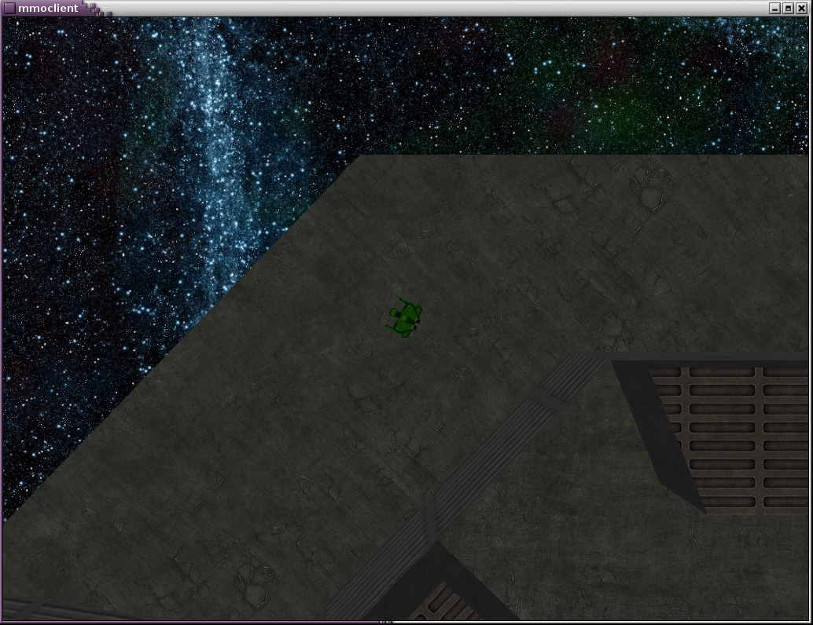
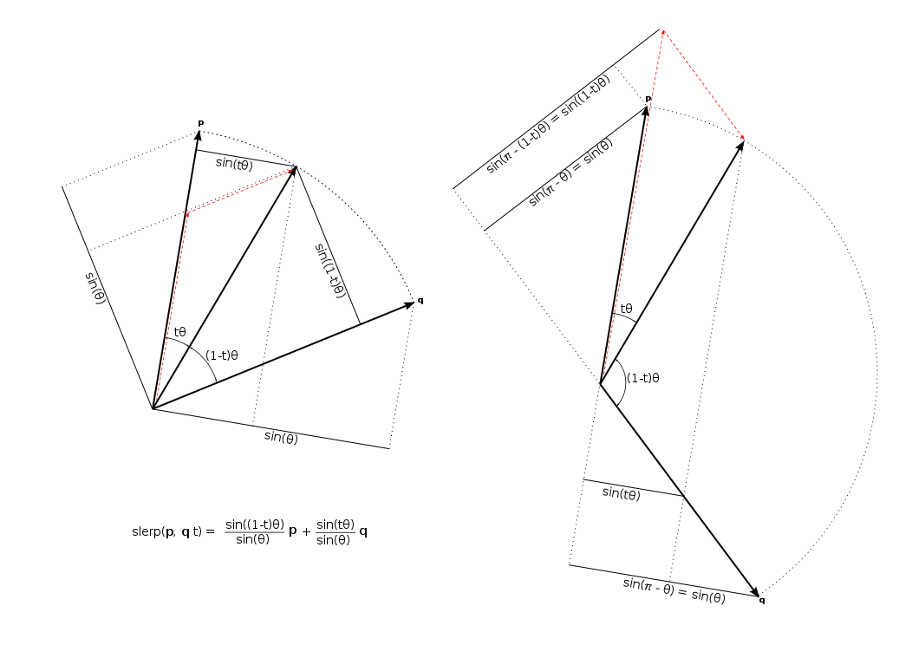
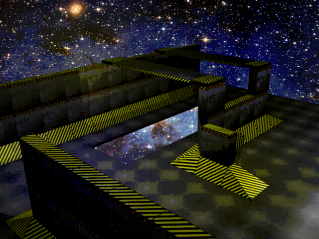
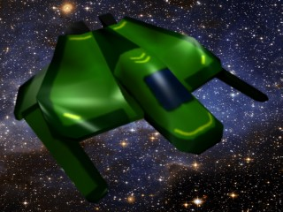

# space-game

A top-down multiplayer space shooter game inspired by
[Continuum](https://www.subspace-continuum.com/). Being far too ambitious in
scope I never finished it, but it was a good learning exercise nonetheless. It
is written in C++ and uses the [Ogre 3D](https://www.ogre3d.org/) graphics
engine. The models I created in [Blender](https://www.blender.org/).

